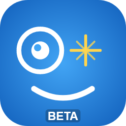

# JITAI Wizard -- Android Companion Suite

<p align="center">
  
</p>

<p align="center">
  <b>Latest release:</b> <a href="https://github.com/BloodWolfPlayer/JITAI-WizardAndroid/releases">v1.2.0</a> &middot; signed Phone APK + Wear OS APK
</p>

_A research-grade intervention delivery system for Wear OS and Android._
_Project for the Bachelor of Science in the University of Siegen_

* Be warned, this Readme is auto-updated by a LLM under Sebastians control. Info may not be accurate until full manuel review. 
* If you find something inaccurate, please correct it or mark it.
---

> **Maintenance note:** This file is the authoritative reference for the project. If you change a screen, a protocol path, a port number, a sensor, a game mechanic, or a build target, update the relevant section here before merging. If you believe something new is to be added to the contents, go for it.

---

## Table of Contents

1. [Overview](#overview)
2. [Download & Install](#download--install)
3. [System Architecture](#system-architecture)
4. [Requirements](#requirements)
5. [Building the Project](#building-the-project)
6. [Phone Application](#phone-application)
7. [Odi -- The Character](#odi----the-character)
8. [Wear OS Application](#wear-os-application)
9. [Intervention Types and Notification Options](#intervention-types-and-notification-options)
10. [Communication Protocol Reference](#communication-protocol-reference)
11. [Logging and Data Export](#logging-and-data-export)
12. [Known Limitations and Notes](#known-limitations-and-notes)

---

## Overview

JITAI Wizard is a platform for delivering Just-In-Time Adaptive Interventions (JITAIs) in behavioral research studies. An intervention is a prompt, task, or micro-game that is triggered at a precise moment in time, typically in response to a physiological or behavioral signal, with the goal of reinforcing or redirecting a participant's behavior.

The system has three tiers:

- **ControlStation** -- a Windows desktop application used by the researcher to design experiments, discover participant devices, send interventions, and record data. You can find this in a different Github repository under the same account: JITAI-WizardControlStation.
- **Android Phone** -- runs the companion app, which acts as a bridge: it hosts an HTTP server for ControlStation, relays intervention commands to the watch, receives sensor data back from the watch, and streams it upstream. 
- **Wear OS Watch** -- runs the watch app, which collects biometric sensor data, displays interventions to the participant, and hosts the interactive micro-games.

Both Android modules share the application ID `com.BWPStudio.JITAIWizard`, which is required for the Wearable Data Layer to link the phone and watch apps together.

---

## Download & Install

> Just want to run it? Grab the signed APKs from the [**Releases page**](https://github.com/BloodWolfPlayer/JITAI-WizardAndroid/releases) -- no build tools required.

Every release ships both APKs signed with the **same key**, so the Wearable Data Layer handshake works out of the box. Always install the phone and watch builds **from the same release**.

| File | Install on | Minimum OS |
|------|-----------|------------|
| `JITAI-Wizard-Phone-v1.2.0.apk` | Android phone | Android 10 (API 29) |
| `JITAI-Wizard-Watch-v1.2.0.apk` | Wear OS watch | Wear OS 4.0 (API 33) |

1. On both devices, allow installs from your browser/file manager (**Settings → Apps → Install unknown apps**).
2. Download and install the **Phone** APK on the Android phone.
3. Download and install the **Watch** APK on the Wear OS watch. (Transfer via the watch's browser, ADB, or a file-push app.)
4. Confirm the phone and watch are paired and signed in to the **same Google account** with Bluetooth on.
5. Open the phone app -- the watch pairs automatically over the Wearable Data Layer.

The Windows **Control Station** is released separately: [JITAI-WizardControlStation releases](https://github.com/BloodWolfPlayer/JITAI-WizardControlStation/releases).

Prefer to build from source? See [Building the Project](#building-the-project).

---

## System Architecture

```
+------------------+           UDP 5280 (discovery)           +-------------------+
|  ControlStation  | <--------------------------------------> |   Android Phone   |
|  Windows / .NET  |           HTTP 8080 (control)            |   mobile module   |
|  Avalonia UI     | <--------------------------------------> |   Ktor server     |
+------------------+           WS 8080/stream (data)          +-------------------+
                                                                        |
                                                               Wearable Data Layer
                                                              (Google Play Services)
                                                                        |
                                                              +-----------------+
                                                              |  Wear OS Watch  |
                                                              |  wear module    |
                                                              |  Sensor service |
                                                              +-----------------+
```

**ControlStation** discovers phones on the local network by listening for UDP beacons. Once connected, it sends experiment commands over HTTP and receives a continuous stream of watch sensor data over a WebSocket.

**The phone** never initiates contact with ControlStation. It broadcasts its presence via UDP and waits for connections. Inbound commands from ControlStation are translated into Wearable Data Layer messages and forwarded to the watch. Data arriving from the watch is buffered and forwarded to any connected WebSocket clients.

**The watch** runs a foreground sensor service at all times. It sends batched sensor snapshots to the phone every second. When an intervention arrives from the phone, the watch displays it as a full-screen activity and optionally launches a micro-game.

---

## Requirements

### Hardware

| Component | Minimum |
|-----------|---------|
| Android phone | Android 10 (API 29) |
| Wear OS watch | Wear OS 4.0 (API 33) |

The phone and watch must be paired to each other and both must be signed in to the same Google account. This is required for the Wearable Data Layer to function. Bluetooth must be enabled on both devices.

For ControlStation connectivity, the phone must be on the same local Wi-Fi network as the Windows PC running ControlStation. The watch communicates with the phone over Bluetooth and does not need direct network access.

### Software

| Tool | Notes |
|------|-------|
| Android Studio  | Required to ensure build works. VSCode may also build but Java is then a must. |
| Java 21 or 11 | Managed by Gradle, if Android Studio is present, no need to manually install. |
| Android Gradle Plugins | Versions specified in `gradle/libs.versions.toml` |

---

## Building the Project

1. Clone the repository:

```
git clone https://github.com/BloodWolfPlayer/JITAI-WizardAndroid.git
```

2. Open the project root in Android Studio. Wait for the Gradle sync to complete. All dependencies are downloaded automatically.

3. To deploy to the phone, select the `mobile` run configuration and run it on a connected Android device (API 29 or higher).

4. To deploy to the watch, select the `wear` run configuration and run it on a connected Wear OS device (API 33 or higher). The watch must be visible to Android Studio, either via Bluetooth or Wi-Fi ADB.

5. Both apps must be installed from the same build and share the same signing key for the Wearable Data Layer capability handshake to succeed.

6. ! Do note, the Emulated devices in Android Studio may not fully complete the handshakes. For best results, use physical devices for testing the full communication flow.

**Application ID:** `com.BWPStudio.JITAIWizard` -- set in both `mobile/build.gradle.kts` and `wear/build.gradle.kts`. Do not change this without updating both files simultaneously.

### Build Configuration Summary

| Setting | Phone (mobile) | Watch (wear) |
|---------|---------------|--------------|
| compileSdk | 36 | 36 |
| minSdk | 29 | 33 |
| targetSdk | 36 | 36 |
| applicationId | com.BWPStudio.JITAIWizard | com.BWPStudio.JITAIWizard |
| Java / Kotlin | 21 or 11 | 21 or 11 |
| Compose | Enabled | Enabled |

---

## Phone Application

The phone app serves as the central hub of the system. It runs at all times in the foreground and hosts services for both directions of communication.

### What Starts on Launch

When the app launches, the `JITAIWizardApp` application class initializes the following components in order:

- **ExperimentLogger** -- writes experiment events to TSV files on the device.
- **WearSyncLogger** -- records all Wearable Data Layer send and receive events.
- **KtorServer** -- starts the HTTP and WebSocket server on port 8080.
- **UdpBeacon** -- begins broadcasting a discovery packet on UDP port 5280 every 5 seconds.

### Screens

#### User View (default screen)

This is the screen a participant or study facilitator sees during a session. It contains:

- **Odi** -- the animated mascot character. See the [Odi section](#odi----the-character) for details.
- **Stats card** -- displays current BPM, last reaction time in milliseconds, and watch connection status (filled circle = connected, empty circle = not connected). Long-pressing this card for 3 seconds unlocks the Debug View.
- **Session timer** -- shows elapsed time since the app started, in minutes and seconds.
- **Last action** -- the most recent response received from the watch (for example, what button a participant pressed on an intervention screen).

#### Debug View (researcher access)

Unlocked by long-pressing the stats card on the User View for 3 seconds. Contains two tabs:

**Control Screen**

Lets a researcher manually compose and send a single intervention to the watch. Options include:

- Free-text message field (default: "Stop!")
- Intervention type: Text, Timer, or Yes/No
- Micro-game selection: None, Lock Picking, Simon Says, Trivia, or Stand Still
- Duration slider: 1 to 60 seconds
- Notification type buttons covering all vibration, sound, and combined options
- A cancel button that stops any currently running intervention on the watch (requires confirmation)

**Experiment Screen**

Lets a researcher design and run a structured experiment sequence. 
As close as possible to Robin Buchards Features, which include:

- An ordered list of events, each with a duration, event type, and optional intervention
- Drag-to-reorder in edit mode
- Run mode: steps through events sequentially, shows elapsed time per event, and allows manually jumping to the previous or next event
- A "Send intervention" button (available once per event during run mode)
- Participant ID and experiment name fields
- Save and load named experiment schedules on the phone
- The Load dialog also has an **Import from phone…** button that opens a file picker; the chosen experiment JSON is saved as a schedule slot and appears in the list immediately
- The Save dialog has an **Export to file (Downloads)** button that writes the current experiment as a `.json` to `Downloads/JITAI_WIZARD_experiments/` (visible in the Files app / over USB) and shows the saved path in a toast
- Three extra templates ship bundled and appear ready-to-load in the Load dialog -- **Distraction Combo - No Games**, **Alternate Microgame - Lock Picking**, and **Stand Still Only** -- alongside the seeded default. They mirror the Control Station's `Assets/experiment_*.json`. Each is a single hand-wash cycle (Wizard-of-Oz, no tutorial) with a clearly marked HW-timer start/stop. Deleting a bundled template will not bring it back on the next launch.
- Optional TSV log output to Downloads/JITAI_WIZARD_logs
- Optional standalone **CSV export** to `Downloads/JITAI_WIZARD_csv/` (same "Save Logs" toggle): a 1:1 reproduction of the ControlStation multi-section CSV, captured on the phone alone — no ControlStation required

### HTTP Server

The Ktor server runs on port 8080 and accepts connections from ControlStation (or any HTTP client on the same network).

| Method | Path | Purpose |
|--------|------|---------|
| GET | /status | Returns watch connection state, session ID, uptime in seconds, and last BPM reading |
| GET | /data | Returns session ID, participant label, last reaction time (ms), last heart rate, and last action string |
| POST | /trigger | Accepts an intervention request (JSON), sends it to the watch, returns the intervention ID |
| POST | /trigger/fire | Fires a manual trigger event by trigger ID |
| GET | /participant | Returns the current participant info object |
| POST | /participant | Sets participant info (id, sessionId, label, deviceIp) — must be called by ControlStation before starting a session so that watch data is linked to the correct session row in the database |
| GET | /experiment | Returns the current experiment configuration JSON; includes an ETag header for conflict detection |
| PUT | /experiment | Replaces the experiment configuration; returns 409 if the client ETag does not match |
| POST | /experiment/control | Sends a run command: start, auto, pause, stop, next, or prev |
| GET | /logs?since=\{id\}&limit=\{n\} | Returns a page of session log entries with IDs greater than `since`; used by ControlStation as a polling fallback when the /events WebSocket is unavailable |
| GET | /trivia | Returns the current list of trivia questions |
| POST | /trivia | Replaces the trivia question bank with the provided list |
| WS | /stream | WebSocket: streams WatchDataBatch JSON objects in real time as they arrive from the watch. ControlStation persists every batch into the `watch_data` table. |
| WS | /events | WebSocket: streams WsEnvelope JSON objects for experiment state changes, log entries, trigger fires, and run/intervention lifecycle events. ControlStation uses these to populate `session_logs`, `experiment_runs`, and `distraction_runs`. |

### UDP Beacon

Every 5 seconds the phone broadcasts a UDP packet on port 5280 to the local subnet. The payload is a JSON object:

```json
{"app": "JITAIWizard", "port": 8080, "name": "<device model>"}
```

ControlStation listens on this port to populate its device discovery list.

### Wearable Data Layer

**Outgoing (phone to watch):**

- Interventions are sent via `MessageClient` to the path `/intervention/trigger` as serialized JSON.
- Ping messages are sent to `/ping` to check connectivity.
- Node discovery uses the capability name `jitai_wizard_wear`, with a fallback to any connected node on first-run scenarios.

**Incoming (watch to phone):**

The `WearMessageListener` service handles three incoming message paths:

| Path | Purpose |
|------|---------|
| /intervention/response | Participant's response to an intervention (choice, result); updates reaction time |
| /watch/data | A WatchDataBatch object containing sensor snapshots from the last second |
| /pong | Response to a ping; used to confirm the watch is reachable |

Received sensor batches are forwarded to the `WatchDataRelay` shared flow, which distributes them to the WebSocket stream and the User View ViewModel simultaneously.

### Logging
! Logging Destinations, Style and Format are not final. 

- **Experiment logs:** TSV files written to `Downloads/JITAI_WIZARD_logs/`. File name format: `{experimentName}_log_{participantName}_{timestamp}.tsv`. Columns: timestamp, participant, event_type, value, details.
- **Wear sync log:** `wear_sync_logs.tsv`, written to app-internal storage. Columns: timestamp, event_type, value, path, node_id, payload_bytes, details.

---

## Odi -- The Character

Odi is the animated mascot that appears on both the phone and watch. It is drawn entirely in code using Jetpack Compose Canvas. There is no image file behind it to make it smooooth.

### Design

The character is made of three geometric shapes:

- **Left eye:** A full circle outline with a white pupil inside. The "O" shape.
- **Right eye:** A D-shape, a semicircle with a flat left edge and a curved right edge. The "D" shape.
- **Mouth:** A C-shaped arc at the bottom of the face. The "C" shape.

The three shapes together spell "Odi." (if you squint reeeaaallly hard. Odi OCD)

The color palette uses two shades of blue: a deep primary blue (`#1565C0`) for the outlines and a lighter accent blue (`#42A5F5`) for highlights.

### Animation States
! Not fully implemented.

| State | Behavior |
|-------|---------|
| IDLE | Passive blinking at random intervals between 3 and 5.5 seconds. Blink duration is 120 ms. |
| TALKING | Mouth arc widens smoothly over 300 ms using an ease-in/ease-out curve. |
| THINKING | The whole character bobs gently up and down on a 600 ms cycle. |
| CELEBRATING | The character scales up to 1.1x its size with a bouncy spring animation and holds a wider mouth. |

### Dialogues

The phone app drives Odi's dialogue lines. They change based on the current animation state.

**Idle:** "Monitoring...", "Stay sharp!", "I'm watching...", "All clear.", "Processing..."

**Talking:** "Focus... you can do this!", "Check your phone.", "Task incoming."

**Thinking:** "Analyzing...", "Hmm...", "Computing...", "One moment..."

**Celebrating:** "You resisted!", "Excellent control!", "Mind over matter!", "Strong work!", "Outstanding!"

These are currently more just placeholders, feel free to add to them or adjust what you need! Do note a 32 character limit for now.

### Where Odi Appears

- Phone: User View screen (reacts to session state -- idle, talking when an intervention fires, celebrating when the participant responds successfully)
- Watch: Main screen (MainActivity), centered on the round display with a BPM badge
- Watch: Positive Feedback screen (always CELEBRATING state)

---

## Wear OS Application

The watch app requires Wear OS 4.0 (API 33) or higher. It is not standalone -- it requires the phone app to be running and the devices to be paired.
Standalone functionality is not currently planned, as focus is on the Wizard of Oz research for now.

### Main Screen

The main screen (`MainActivity`) shows:

- Odi centered on the round display.
- A BPM badge on the left edge of the screen, with a pulsing animation when the sensor service is active.
- A status line below Odi describing the current state ("Odi is watching", "Hi, I'm Odi", "Waiting for sensors...", etc.).
- A permission request prompt if the required health permissions have not been granted yet.

### Permission Flow

The watch requests permissions in two groups:

**Mandatory (the service will not start without these):**
- `ACTIVITY_RECOGNITION`
- `POST_NOTIFICATIONS`

**Sensor (at least one required for heart rate collection):**
- `health.READ_HEART_RATE`
- `BODY_SENSORS`

`WatchDataService` starts automatically once all mandatory permissions are granted and at least one sensor permission is available.

### WatchDataService

A foreground health service that collects sensor data continuously. It uses a dual strategy for heart rate to maximize device compatibility:

- **Primary:** Android Health Services API (`MeasureClient`, `DataType.HEART_RATE_BPM`)
- **Fallback:** Legacy `SensorManager` with `Sensor.TYPE_HEART_RATE`

Both strategies run simultaneously. Whichever delivers a reading first wins for that moment. This ensures the service works on devices that only partially support Health Services.

Every 1000 ms, all buffered sensor readings since the last batch are packaged into a `WatchDataBatch` and sent to the phone via the Wearable Data Layer.

### Sensors Collected

| Sensor | Source | Sampling Rate | Data Fields |
|--------|--------|---------------|-------------|
| Heart rate | Health Services + SensorManager | Event-driven | heartRate (BPM) |
| Accelerometer | SensorManager | GAME (~50-200 Hz) | accelX, accelY, accelZ |
| Gyroscope | SensorManager | GAME (~50-200 Hz) | gyroX, gyroY, gyroZ |
| Rotation vector | SensorManager | GAME | rotationX, Y, Z, W |
| Step counter | SensorManager | NORMAL | stepCount |
| Barometer | SensorManager | NORMAL | barometer (hPa) |
| Light | SensorManager | NORMAL | light (lux) |

Each `WatchDataSnapshot` contains: timestamp, all fields above, and a sessionId.

### Wearable Data Layer

**Incoming (phone to watch):**

Handled by `WearMessageListener`:

| Path | Action |
|------|--------|
| /intervention/trigger | Deserializes the Intervention JSON and launches the appropriate activity or game |
| /phone/task | Displays a prompt to check the phone |
| /ping | Responds immediately with /pong |

When any message arrives, `WearMessageListener` also auto-starts `WatchDataService` if it is not already running and permissions are available.

**Outgoing (watch to phone):**

| Path | Content |
|------|---------|
| /intervention/response | String response from the participant (their choice or game result) |
| /watch/data | Serialized WatchDataBatch (sensor snapshots) |
| /pong | Timestamp string echoed back from a /ping |

### InterventionActivity

Displayed when the watch receives an intervention from the phone. Supports three modes:

**Text mode:** Shows a message and an OK button. The participant dismisses it manually or it times out.

**Yes/No mode:** Shows a question and two buttons. The participant's choice is sent back to the phone as a response.

**Timer mode:** Shows a circular countdown arc that transitions from green to yellow to red as time runs out. A green arc at the outer edge tracks the total session. The participant presses OK at any point.

All modes support vibration patterns and optional looping sounds. The screen is kept on for the duration. If the participant does not respond within the configured duration, the activity auto-dismisses.

### Micro-games

Micro-games are launched by `WearMessageListener` when the incoming intervention specifies a game type. All games extend `MicrogameActivity`, which provides common utilities (vibration, messaging, permission checks, tutorial screens).

#### Stand Still

The participant must hold the watch completely still for 10 consecutive seconds.

- Uses the accelerometer. Calculates motion magnitude as `sqrt(x^2 + y^2 + z^2) - 9.8`.
- Motion threshold: 0.5 m/s^2. Any movement above this resets the 10-second timer.
- Display: circular progress ring (green when still, red when moving) and a countdown.
- Total timeout: 30 seconds.

#### Trivia

A multiple-choice question with four answer options.

- Questions can be embedded in the intervention JSON or fall back to a default question.
- Correct answer triggers success; wrong answer triggers failure.
- Result is shown immediately after the participant taps.
- Total timeout: 30 seconds.

#### Simon Says

A color sequence memory game.

- Runs 4 rounds. Each round extends the sequence by one color.
- Colors: Red, Blue, Green, Yellow, shown in a 2x2 grid.
- Phase 1 (SHOW): the computer highlights colors in sequence with vibration feedback.
- Phase 2 (INPUT): the participant must tap the same sequence in order.
- A mistake ends the game immediately.
- TODO: It currently crashes on failure.
- Total timeout: 60 seconds.

#### Lock Picking

A three-stage precision game.

**Stage 1 -- Hold Still (2 seconds):** Same accelerometer logic as Stand Still. Threshold is tighter at 0.3 m/s^2. A cyan arc shows progress.

**Stage 2 -- Swipe in a Circle:** The participant swipes in a circular motion on the screen. Accumulated rotational angle is tracked until a full 270-degree sweep is complete. A yellow arc shows progress.

**Stage 3 -- Tap Timing:** A dot travels around a circular track, completing one full revolution every 3 seconds. A green zone occupies 30 to 90 degrees of the track. The participant must tap a button when the dot is inside the green zone. Feedback is shown ("Perfect!" or "Too early/late!").

Total timeout: 60 seconds.

### Positive Feedback Screen

Shown after a successful game. Green background, Odi in CELEBRATING state, and a random congratulatory message. Auto-dismisses after 3 seconds.

Messages: "You resisted!", "Excellent control!", "Mind over matter!", "Strong work!", "Keep it up!", "Well done!", "You did it!"

### Complication

`MainComplicationService` provides a SHORT_TEXT complication displaying the current day of the week (Mon, Tue, etc.). It updates every hour. This complication can be added to any watch face that supports SHORT_TEXT slots.

### Tile

`MainTileService` provides a Wear OS tile. The current implementation is a placeholder ("Hello, Tile!") and is intended for future expansion.

---

## Intervention Types and Notification Options

### Intervention Display Types

| Type | Description |
|------|-------------|
| Text | A message is shown with a single OK button |
| Yes/No | A question is shown with Yes and No buttons |
| Timer | A circular countdown is shown with an OK button |

### Micro-game Types

| Type | Description |
|------|-------------|
| None | No game; just the intervention display |
| Stand Still | Accelerometer-based stillness challenge |
| Trivia | Multiple-choice question |
| Simon Says | Color sequence memory game |
| Lock Picking | Three-stage precision challenge |

### Notification Types

| Type | Description |
|------|-------------|
| Vibration Short | Single short vibration pulse |
| Vibration Long | Single long vibration pulse |
| Sound Short | Single notification tone |
| Sound Long | Alarm tone, plays once |
| Vib + Sound Short | Short vibration and notification tone together |
| Vib + Sound Long | Long vibration and alarm tone together |
| Perma Vibration | Repeating vibration pattern until dismissed |
| Perma Sound | Looping alarm tone until dismissed |
| Perma Both | Repeating vibration and looping sound together |

---

## Communication Protocol Reference

### Wearable Data Layer Message Paths (Phone to Watch and Back)

| Direction | Path | Content |
|-----------|------|---------|
| Phone to Watch | /intervention/trigger | Serialized Intervention JSON |
| Phone to Watch | /phone/task | String (task description) |
| Phone to Watch | /ping | Timestamp string |
| Watch to Phone | /intervention/response | String (participant response or game result) |
| Watch to Phone | /watch/data | Serialized WatchDataBatch JSON |
| Watch to Phone | /pong | Timestamp string echoed from /ping |

### Capability Names

| Capability | Declares |
|------------|---------|
| jitai_wizard_phone | Phone app (used by watch to resolve the phone node) |
| jitai_wizard_wear | Watch app (used by phone to resolve the watch node) |

### HTTP Endpoints (ControlStation to Phone)

See the [HTTP Server](#http-server) section of the Phone Application chapter above for the full route table. For details on how ControlStation calls these endpoints, see the ControlStation repository README (JITAI-WizardControlStation, same GitHub account).

### UDP Beacon

**Port:** 5280 (broadcast)
**Interval:** Every 5 seconds
**Payload format:**

```json
{"app": "JITAIWizard", "port": 8080, "name": "<device model>"}
```

---

## Logging and Data Export

### Where sensor data is stored

Raw sensor data (heart rate, accelerometer, gyroscope, rotation, barometer, light, steps) is streamed in real time to ControlStation over the `/stream` WebSocket and persisted in ControlStation's SQLite database (`%APPDATA%\OcdWizard\data.db`), table `watch_data`. If ControlStation is not connected when data arrives, those batches are not stored there (the in-memory relay buffer holds at most 64 batches).

To export sensor data as a CSV you have two options: use the Export function in ControlStation (see the ControlStation README for the format), **or** enable the phone-side CSV export below to capture an equivalent file with only the phone present.

### Phone-Side CSV Export (1:1 with ControlStation)

When **Save Logs** is enabled, starting a manual run on the Experiment screen begins capturing the live watch stream to a CSV; stopping or finishing the run writes the finished file to `Downloads/JITAI_WIZARD_csv/` (`{experiment}_{participant}_{timestamp}.csv`) and shows the path in a toast. The file reproduces the ControlStation export layout section-for-section:

| Section | Source on phone | Fidelity |
|---------|-----------------|----------|
| `=== SESSION ===` | `name` = participant/session name (`participantId`); `notes` = the in-run 📝 Note entries (joined); `participants` = same participant name — matching the Control Station's `sessions.name` / `sessions.notes` / `participant_key` | Full |
| `=== WATCH DATA ===` | live `WatchDataRelay` stream (`participant_label,participant_key,timestamp,heart_rate,accel_x/y/z,gyro_x/y/z,rot_w/x/y/z,baro_hpa,light_lux,step_count`) | Full — every snapshot |
| `=== SESSION LOGS ===` | `SessionLogStore` ring buffer | Full (last 2000 entries) |
| `=== INTERVENTIONS ===` | synthesised from the session-log stream | Timing/response/reaction faithful; `game_type`/`notification_type` left blank |
| `=== EXPERIMENT RUNS ===` | run id + timing | Single row for the run |
| `=== DISTRACTION RUNS ===` | synthesised from intervention send/response pairs | Best-effort |

To protect the phone, sensor rows are written **one buffered append per watch batch** (the watch already groups snapshots into ~100 ms batches at its 50 Hz cap), so a full-rate stream costs only ~10 disk flushes per second. Captured by `PhoneCsvLogger`; covers the manual Start/Stop/Finish flow (engine "Auto" runs are not yet wired).

### Phone-Side Logs

**Experiment logs**

Written by `ExperimentLogger` to `Downloads/JITAI_WIZARD_logs/`. Filename: `{experimentName}_log_{participantName}_{timestamp}.tsv`. These are also forwarded to ControlStation via the `/events` WebSocket and stored in the `session_logs` table in the database.

| Column | Description |
|--------|-------------|
| timestamp | Unix timestamp in milliseconds |
| participant | Participant label |
| event_type | Type of event (e.g., intervention_sent, response_received) |
| value | Numeric value associated with the event |
| details | Free-text detail string |

**Wear sync log**

Written by `WearSyncLogger` to app-internal storage as `wear_sync_logs.tsv`. Useful for debugging communication issues between the phone and watch.

| Column | Description |
|--------|-------------|
| timestamp | Unix timestamp in milliseconds |
| event_type | wear_send, wear_receive, or wear_connection |
| value | Numeric value (e.g., BPM, reaction time) |
| path | Wearable Data Layer message path |
| node_id | ID of the remote node (watch or phone) |
| payload_bytes | Size of the message payload |
| details | Free-text detail string |

---

## Known Limitations and Notes

- The phone must be on the same Wi-Fi subnet as the PC running ControlStation. The HTTP server on port 8080 is unencrypted and unauthenticated -- do not expose it on a public network. For realsies.
- Wear OS 4.0 (API 33) is the minimum required for the watch. Devices running earlier versions of Wear OS are not supported. Recommended is Android 15 and WearOS 6.0+.
- `BODY_SENSORS_BACKGROUND` is intentionally commented out in the watch manifest. Re-enabling it may require additional permission handling for pre Wear OS 4.0 compatibility.
- The Wear OS Tile (`MainTileService`) is a placeholder and does not display experiment data.
- The Wear OS Complication (`MainComplicationService`) only shows the day of the week. Extending it to show BPM or session state would require a persistent data source (DataClient item or a bound service).
- ProGuard/R8 minification is disabled for release builds. If you enable it, add keep rules for Ktor, kotlinx.serialization, and the Wearable Data Layer classes before distributing.
